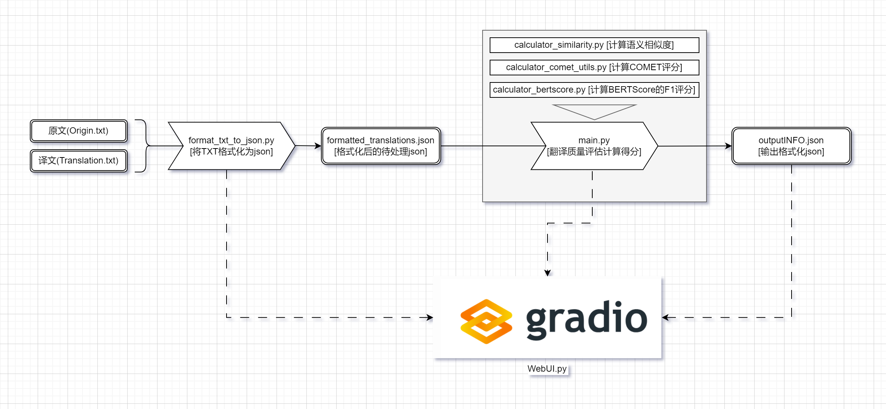
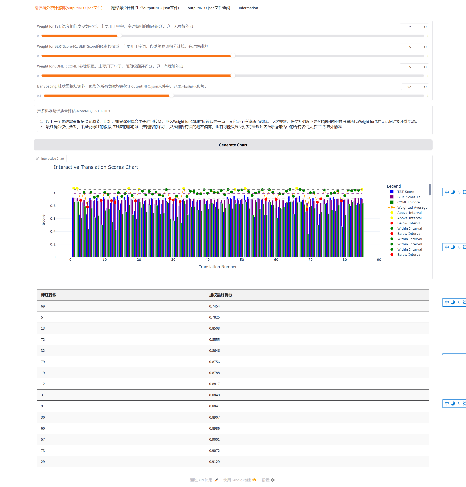
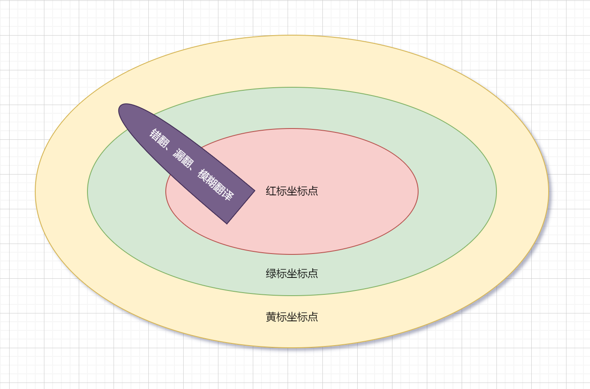

---

# MoreMTQE：更易用的机器翻译质量评估（Machine Translation Quality Estimation）方案

MoreMTQE 是一个用于评估机器翻译质量的项目，其目的在于向校对者们提供多种翻译质量评估指标的通用接口平台，适用于字符级、词级、句子级和段落级的质量估计。通过设置不同的参数权重，可以根据翻译文本的具体特征对翻译质量进行有针对性的评估，迅速筛选出出现翻译问题可能性较大的句子，进而减轻人工校对的负担。

## 项目说明



本项目旨在为机器翻译结果提供自动化的质量评估方法，使用包括语义相似度、BERTScore 和 COMET 在内的多种评估指标进行综合打分，以辅助用户判断翻译结果的可能问题。

整合包制作中...敬请期待。

## 文件命名规范

请确保输入的文件命名和内容满足以下要求：

- **Origin.txt**：原文文件，包含待翻译的源语言句子。
- **Translation.txt**：译文文件，包含机器翻译生成的目标语言句子。
- 两个文件中的句子需 **一一对应**，即每行内容为一个句子，行数一致。

## 使用教程 (默认为windows系统)：

 0、如果您使用了一键整合包，请直接双击启动START_Windows.bat。无需后续操作

 1、如果您使用仓库进行配置，请先克隆仓库并跳转到仓库目录下。
 ```
 git clone https://github.com/chencxt/MoreMTQE.git
 ```
 2、配置并激活虚拟环境：
 ```
 python -m venv .venv
 .venv\Scripts\activate
 ```

 3、在虚拟环境中安装依赖包：

 ```
 pip install -r requirements.txt
 ```

 4、克隆模型文件
 ```
 # Make sure git-lfs is installed (https://git-lfs.com)
 git lfs install
 git clone https://huggingface.co/FacebookAI/xlm-roberta-large
 git clone https://huggingface.co/sentence-transformers/paraphrase-multilingual-mpnet-base-v2
 # wmt22-cometkiwi-da需要在线验证，如果没有则会自动下载，所以请确保网络畅通，并在仓库根目录中新建一个“wmt22-cometkiwi-da”文件夹用来指引下载。
 ```
 5、设置临时环境变量（若您有梯子可跳过此步骤）
 ```
 set HF_ENDPOINT=https://hf-mirror.com
 ```
 6、启动gradio，Enjoy it !
 ```
 python WebUI.py
 # 启动完成后，浏览器输入以下网址并进入: http://127.0.0.1:7860
 # 译文需要命名为Translation.txt，原文需要命名为Origin.txt，将二者放在仓库根目录
 ```
 7、关闭程序。
 ```
 # 先用快捷键Ctrl+C终止程序，然后输入以下程序退出虚拟环境。
 deactivate
 ```

## 参数与权重说明



如果上一个板块使您成功运行了本项目，您会看见如上的界面。

本项目使用三个主要的评估指标，每个指标可设置相应的权重参数：

### ✅ TST 权重（Weight for TST）
- **用途**：用于字符级、词级的翻译得分计算。
- **理解能力**：❌ 无理解能力，仅基于表层语义相似度。
- **权重建议**：TST 不是 MTQE 中推荐的参考指标，**任何情况下不建议设置高权重**。

### ✅ BERTScore-F1 权重（Weight for BERTScore-F1）
- **用途**：用于词级、句子级的翻译得分计算。
- **理解能力**：✅ 具备一定语义理解能力。
- **权重建议**：适用于句法结构相对复杂但句子长度适中的场景。

### ✅ COMET 权重（Weight for COMET）
- **用途**：用于句子级、段落级的翻译得分计算。
- **理解能力**：✅ 强语义理解能力，适合处理长句、复杂句等。
- **权重建议**：若译文中包含较多长难句，应适当提高 COMET 权重，降低 TST 与 BERTScore 权重；若译文句子较短或结构简单，则可以适当下调 COMET 权重。

## 调参建议

请根据您的译文特性调整三个指标的权重：

- **长难句多**：提高 COMET 权重，降低 TST 和 BERTScore 权重。
- **短句简单**：可适当提高 BERTScore 权重，TST 仅作辅助参考。

⚠️ **重要提示**：语义相似度（TST）并不是 MTQE 的核心参考指标，因此在任何场景下，TST 权重都不应设置为较高值。

## 最终得分说明



- 最终评估得分**仅供参考**，并不代表被标红的句子一定翻译有误, 只是被标红的坐标点的译文，出现问题的概率比较大而已。
- 标红的数据点仅表示翻译出错的**概率较高**，其具体原因可能包括：
  - 标点符号未对齐；
  - 句中包含大量专有名词；
  - 翻译风格或术语偏差等非致命问题。

请结合人工检查和上下文理解综合判断译文质量。

---

